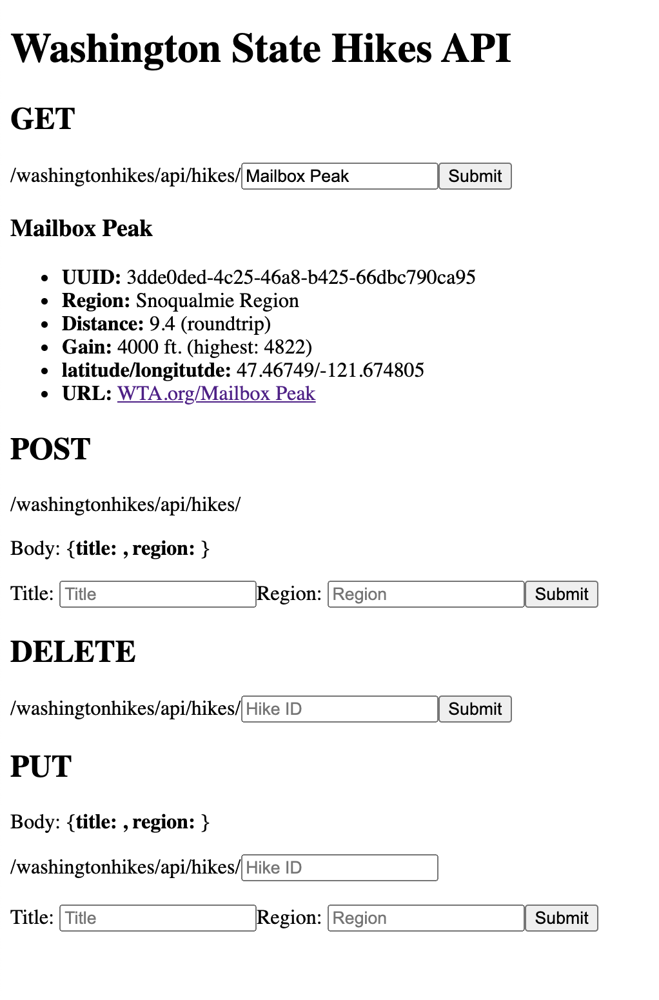

# Washington Hikes API


## Description
> This is a project folder for a Washington Hikes API.
> This API handles REST request routes including GET, POST, DELETE and PUT.
> The server is written using the Node and Express.js framework.
> This project uses Postgres for storing data and, 
> Knex.js for communicating with the database.
> In addition to the backend server that manages API routes, the project includes middleware
> to serve static files to the front-end. The front-end is bundled using Webpack and, 
> provides a simple interface for the user to interact with the API.


## Information About the Data
To see where this data is coming from please see the [wta-web-scraper](https://github.com/yoshiohasegawa/wta-scraper) I built to support this API. More specifically, the database in this project is initially seeded with data that was extracted using this web scraper. To view the Washington hike data used for this project, visit [WTA's Hiking Guide](https://www.wta.org/go-outside/hikes).

___
## Getting Started

To get started you will need to install dependencies:
```console
user@machine:~/washington-hikes-api$ npm i 
```

To continue with the following steps, it is imperative that you have environment variables setup:
```console
user@machine:~/washington-hikes-api$ touch .env
```
In the `.env` file you will need to list the following variables:
```bash
DB_USER=<PSQL_USERNAME>
DB_PW=<PSQL_PASSWORD>
DB_NAME=<PSQL_DATABASE>
DB_HOST=localhost
DB_PORT=5432
```
*Note: You will need to create a psql database on your local machine before running this project. Feel free to call it whatever you like and initialize it in the `.env` file.*

To run the initial migration that will create the "hikes" table run the following command:
```console
user@machine:~/washington-hikes-api$ npm run migrate
```

In case you have to rollback you can run the following command: 
```console
user@machine:~/washington-hikes-api$ npm run rollback
```

To seed the database with initial Washington hikes data, run the following command:
```console
user@machine:~/washington-hikes-api$ npm run seed
```

Finally, to run the server and interact with the interface, run the following command:
```console
user@machine:~/washington-hikes-api$ npm run serve
```
*Note: This project will run on `localhost:9000`*

___
## API Endpoints & Routes
Currently, this project only contains Hike data which we can represent as Hike objects, with various properties. Please check back for further expansions to the database, API endpoints/routes and available objects.

### Hikes
```GET /washingtonhikes/api/hikes```
- Returns an Array of all Hike objects.

```GET /washingtonhikes/api/hikes/:idOrName```
- `idOrName`: either the **uuid** or **name** of the Hike desired.  

```POST /washingtonhikes/api/hikes```
- Request body must contain an object with **title** at a minimum.

```DELETE /washingtonhikes/api/hikes/:id```
- `id`: **id** of the Hike to be deleted.

```PUT /washingtonhikes/api/hikes/:id```
- `id`: **id** of the Hike to be updated.  
- Request body must contain valid properties and values for updating.  

### Example Hike Object
```js
{
    "id":"3dde0ded-4c25-46a8-b425-66dbc790ca95",
    "title":"Mailbox Peak",
    "region":"Snoqualmie Region",
    "distance":9.4,
    "dist_type":"roundtrip",
    "gain":4000,
    "highest":4822,
    "rating":4.22,
    "rating_count":89,
    "latitude":47.46749,
    "longitude":-121.674805,
    "report_date":"2021-04-21T15:00:00.000Z",
    "report_count":1118,
    "url":"https://www.wta.org/go-hiking/hikes/mailbox-peak"
    "created_at":"2021-04-26T09:49:33.943Z",
    "updated_at":"2021-04-26T09:49:33.943Z"
}
```
___
## Front-End Interface
Apologies in advance for it being very bland 😅. The front-end allows for the user to simply test `GET`, `POST`, `DELETE`, and `PUT` requests sent to the back-end API.  
- **_Warning: This will alter your database!_**


___
## Contributors
* Yoshio Hasegawa


## Support / Feedback / Bugs
For support, feedback or, if you've found a bug you may contact the primary contributor here: [Yoshio Hasegawa](mailto:yoshio.seisuke.hasegawa@gmail.com).
